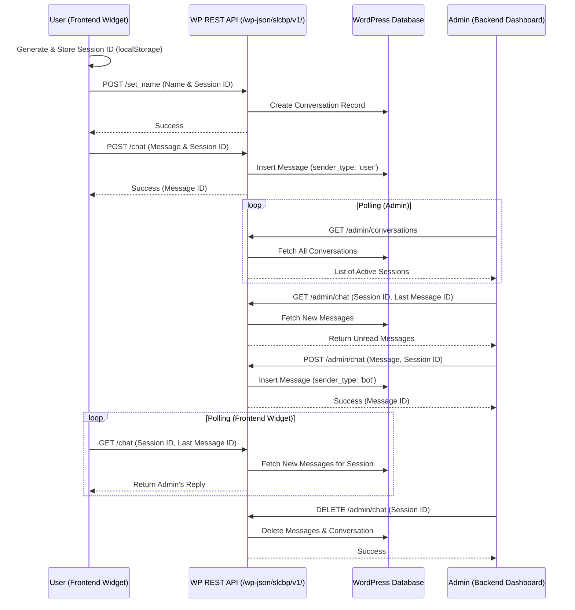

# Smart Live Chat Bot Pro

**Smart Live Chat Bot Pro** is a robust, lightweight, and high-performance real-time human-to-human live chat plugin built exclusively for WordPress. Designed to run smoothly on standard shared hosting without the need for complex WebSocket servers, it utilizes highly optimized AJAX polling to deliver a seamless, instant-messaging experience.

## ✨ Features

- **Real-Time Human-to-Human Chat:** Achieves near-instantaneous synchronization (500ms intervals) between the site visitor and the administrator.
- **Dedicated Admin Dashboard:** A sleek backend UI accessible via the WordPress Admin sidebar (`Live Chat Bot`) to view all active user sessions and reply in real-time.
- **Lead Identification (Name Collection):** New users are automatically prompted to enter their name before chatting, ensuring admins always know who they are talking to.
- **Persistent Sessions:** Utilizing `localStorage`, visitors can refresh the page or navigate across your website without losing their chat history.
- **Race-Condition Protection:** Built-in Javascript asynchronous locking prevents overlapping requests, guaranteeing perfect chronological message rendering.
- **Optimized Database Architecture:** Uses dedicated custom database tables (`wp_chat_conversations` and `wp_chat_messages`) with optimized `INNER JOIN` queries for blazing-fast database reads.
- **Dynamic Notifications:** The frontend widget dynamically alerts users with a visual red badge if an admin replies while the chat box is minimized.
- **Admin Chat Management:** Admins have the ability to permanently delete specific chat histories and clean up their active sessions list.

## 📡 API Structure

The plugin utilizes the WordPress REST API to handle all operations asynchronously.

### Frontend Endpoints

- **`POST /wp-json/slcbp/v1/chat`**
  - **Description:** Sends a new chat message from the user to the bot/admin.
  - **Parameters:** `message` (string), `session_id` (string)
  - **Returns:** `{ status: 'success', reply: 'Message sent.', message_id: <int> }`

- **`GET /wp-json/slcbp/v1/chat`**
  - **Description:** Fetches new messages for a specific session to display on the frontend.
  - **Parameters:** `session_id` (string), `last_id` (int)
  - **Returns:** `{ status: 'success', messages: [...] }`

- **`POST /wp-json/slcbp/v1/set_name`**
  - **Description:** Associates a user's name with their active `session_id`.
  - **Parameters:** `name` (string), `session_id` (string)
  - **Returns:** `{ status: 'success' }`

### Admin Endpoints (Requires `manage_options` capability)

- **`GET /wp-json/slcbp/v1/admin/conversations`**
  - **Description:** Retrieves all active chat sessions/conversations for the admin dashboard.
  - **Returns:** `{ status: 'success', conversations: [...] }`

- **`GET /wp-json/slcbp/v1/admin/chat`**
  - **Description:** Retrieves messages for a specific conversation in the admin panel.
  - **Parameters:** `session_id` (string), `last_id` (int)
  - **Returns:** `{ status: 'success', messages: [...] }`

- **`POST /wp-json/slcbp/v1/admin/chat`**
  - **Description:** Sends a message from the admin to the user.
  - **Parameters:** `message` (string), `session_id` (string)
  - **Returns:** `{ status: 'success', message_id: <int> }`

- **`DELETE /wp-json/slcbp/v1/admin/chat`**
  - **Description:** Deletes a complete conversation and its messages.
  - **Parameters:** `session_id` (string)
  - **Returns:** `{ status: 'success' }`

## 🔄 Plugin Flow & Architecture

Below is a flow diagram illustrating the communication between the User (Frontend), Admin (Backend), and the WordPress REST API:

## 🚀 Installation

1. Upload the `smart-live-chat-bot-pro` folder to the `/wp-content/plugins/` directory of your WordPress installation.
2. Navigate to the **Plugins** menu in WordPress and click **Activate** for "Smart Live Chat Bot Pro".
3. Upon activation, the plugin will automatically generate the required optimized database tables.
4. The floating chat widget will instantly appear on the bottom right of your frontend website.

## 💻 How to Use

### For Website Visitors (Frontend)
1. Click the blue floating chat bubble on the bottom right of the screen.
2. The bot will ask for your name. Type your name and press **Send**.
3. A session is instantly created, and an admin will be notified. Start chatting!

### For Site Administrators (Backend)
1. Log into your WordPress Admin Dashboard.
2. Click on the **Live Chat Bot** menu item on the left-hand sidebar.
3. You will see a list of "Active Sessions" on the left, displaying the visitor's Name and Session ID.
4. Click on any session to open the chat window and instantly reply.
5. To end and clear a conversation, click the red **Delete Chat** button in the top right corner of the chat window.

## 🛠 Technical Details

- **Language Stack:** PHP, JavaScript (jQuery), HTML, Vanilla CSS.
- **API Architecture:** WordPress REST API (`/wp-json/slcbp/v1/`).
- **Database Tables:** 
  - `wp_chat_conversations`: Tracks active sessions, user names, and metadata.
  - `wp_chat_messages`: Stores individual chat messages linked via `conversation_id`.
- **Polling Logic:** To bypass the strict WebSocket limitations of standard PHP hosting, this plugin relies on a heavily optimized short-polling engine running at 500ms intervals, protected by request locks to prevent duplicate rendering.
